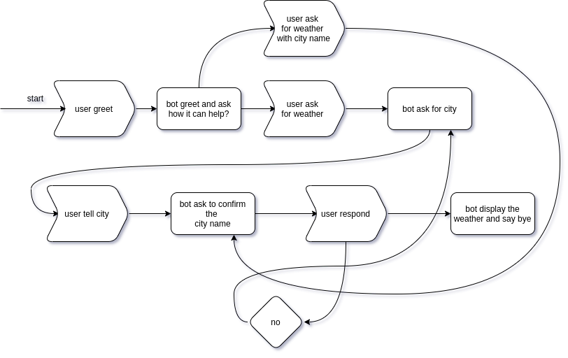

# rasa weather bot

- **rasa train**: train a model
- **rasa run actions**: start a action server
- **rasa shell**: start a shell to test your model
- **rasa interactive**: create flow in interactive way

## Diagram

